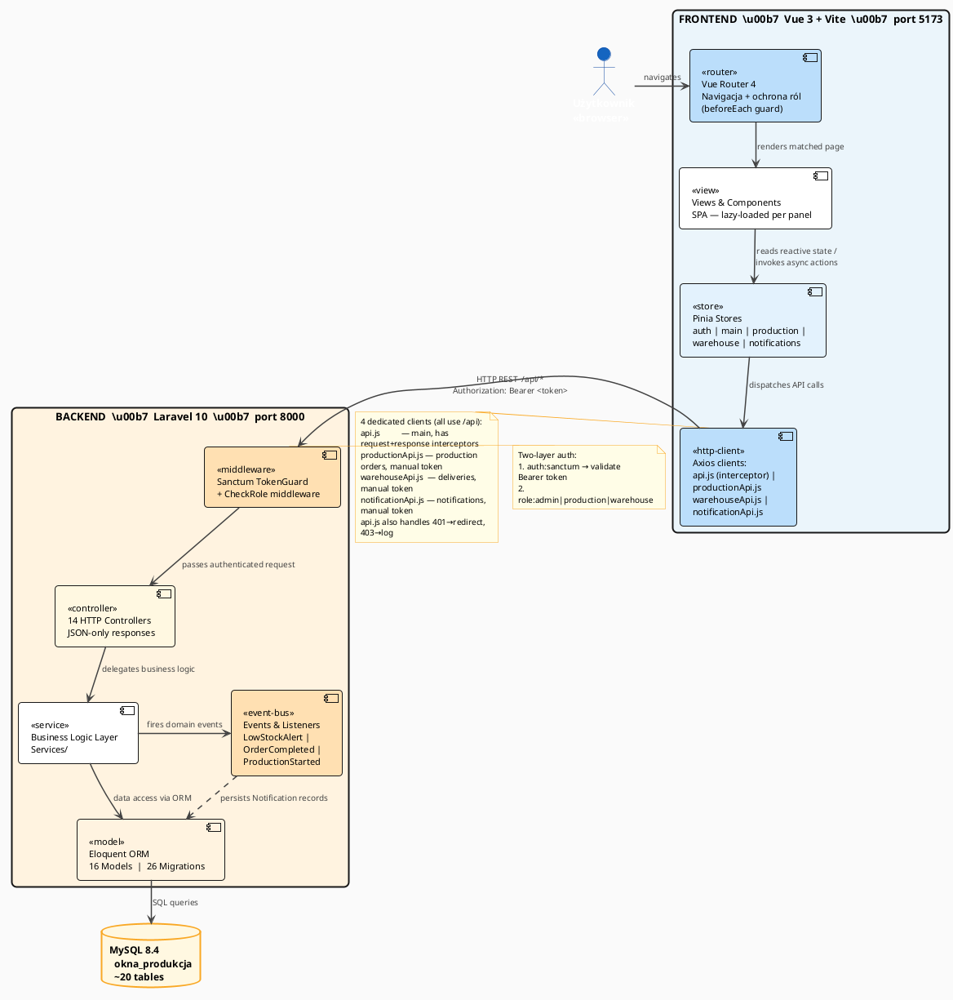

# Architektura Ogólna Systemu

## Schemat wysokopoziomowy

Dwie osobne aplikacje komunikujące się przez HTTP:

```
Przeglądarka → Vue 3 (port 5173) → [Vite proxy /api → :8000] → Laravel API → MySQL
```

- **Frontend** (Vue 3): odpowiada za UI, routing, zarządzanie stanem
- **Backend** (Laravel): RESTful API, autoryzacja, logika biznesowa, baza danych
- **Między nimi**: tokeny Sanctum (Bearer token w nagłówku HTTP `Authorization: Bearer <token>`)

## Diagram



## Stos technologiczny

| Warstwa | Technologia | Wersja | Po co |
|---------|-------------|--------|-------|
| Frontend | Vue 3 + Composition API | 3.x | UI, SPA w przeglądarce |
| State | Pinia | 2.x | Globalny stan aplikacji |
| Routing | Vue Router | 4.x | Nawigacja + ochrona ról |
| HTTP | Axios | 1.x | Komunikacja z API |
| Build | Vite | 5.x | Bundler, dev proxy |
| Backend | Laravel | 10.x | REST API, logika biznesowa |
| Auth | Laravel Sanctum | — | Tokeny Bearer |
| ORM | Eloquent | — | Dostęp do MySQL |
| Baza | MySQL | 8.4.3 | Persystencja danych |
| PHP | PHP | 8.3.28 | Środowisko backendu |

## Proxy Vite (jak /api trafia do Laravela)

Plik: `frontend/vite.config.js`

```js
server: {
  proxy: {
    '/api': {
      target: 'http://localhost:8000',
      changeOrigin: true
    }
  }
}
```

**Efekt**: `fetch('/api/materials')` w przeglądarce → Vite proxy → `http://localhost:8000/api/materials`  
Dzięki temu nie ma CORS errors w developmencie i token nie wycieka przez full URL.

## Struktura katalogów

```
vueLavarell/
├── backend/                  ← Laravel 10 API
│   ├── app/
│   │   ├── Http/Controllers/ ← 14 kontrolerów (odpowiedzi JSON)
│   │   ├── Models/           ← 16 modeli Eloquent
│   │   ├── Middleware/       ← auth:sanctum, role:xxx
│   │   ├── Services/         ← logika biznesowa
│   │   ├── Policies/         ← autoryzacja na poziomie modeli
│   │   └── Exceptions/       ← Handler.php (JSON 401 zamiast redirect)
│   ├── database/
│   │   ├── migrations/       ← 26 migracji
│   │   └── seeders/          ← dane testowe
│   └── routes/api.php        ← wszystkie endpointy
│
└── frontend/                 ← Vue 3 + Vite
    └── src/
        ├── views/            ← strony (LoginView, HomeView, etc.)
        │   ├── admin/        ← widoki tylko dla admina
        │   ├── production/   ← widoki panelu produkcji
        │   └── warehouse/    ← widoki magazynu
        ├── stores/           ← Pinia (auth, main, production, warehouse)
        ├── services/         ← api.js, warehouseApi.js (Axios)
        ├── router/index.js   ← definicje tras + guardy
        └── components/       ← komponenty współdzielone
```
