# Baza Danych — Diagram ERD i Opis Tabel

## Diagram ERD

```plantuml
@startuml ERD_okna_produkcja
!pragma layout smetana

skinparam backgroundColor #FAFAFA
skinparam defaultFontName Arial
skinparam defaultFontSize 11

skinparam entity {
  BackgroundColor #FFFFFF
  BorderColor #455A64
  BorderThickness 1.5
  FontSize 11
  HeaderBackgroundColor #455A64
  HeaderFontColor #FFFFFF
  HeaderFontStyle bold
}

skinparam arrow {
  Color #455A64
  Thickness 1.2
  FontSize 10
  FontColor #546E7A
}

' ─────────────────────────────
' USERS & AUTH
' ─────────────────────────────
entity "users" as users #EDE7F6 {
  * id         : BIGINT      <<PK>>
  --
  name         : VARCHAR(255)
  email        : VARCHAR(255) <<UNIQUE>>
  password     : VARCHAR(255) <<bcrypt>>
  role         : ENUM(admin, production, warehouse)
  created_at   : TIMESTAMP
}

' ─────────────────────────────
' PRODUCT CATALOG
' ─────────────────────────────
entity "profiles" as profiles #E8F5E9 {
  * id       : BIGINT  <<PK>>
  --
  name       : VARCHAR
  material   : VARCHAR  ' PVC / ALU / WOOD
  color      : VARCHAR
}

entity "glasses" as glasses #E8F5E9 {
  * id      : BIGINT  <<PK>>
  --
  name      : VARCHAR
  type      : VARCHAR
  u_value   : DECIMAL(4,2)  ' thermal coefficient
}

entity "windows" as windows #E8F5E9 {
  * id             : BIGINT  <<PK>>
  --
  * profile_id     : BIGINT  <<FK>>
  * glass_id       : BIGINT  <<FK>>
  name             : VARCHAR
  width            : DECIMAL(8,2)
  height           : DECIMAL(8,2)
  price            : DECIMAL(10,2)
  stock_quantity   : INT
  min_stock        : INT
  image_url        : TEXT
  is_active        : BOOLEAN
}

' ─────────────────────────────
' CUSTOMER ORDERS
' ─────────────────────────────
entity "orders" as orders #E3F2FD {
  * id              : BIGINT  <<PK>>
  --
  order_number      : VARCHAR  <<UNIQUE>>
  customer_name     : VARCHAR
  customer_email    : VARCHAR
  customer_phone    : VARCHAR
  delivery_address  : TEXT
  status            : ENUM(pending, in_production,\n                         completed, cancelled)
  total_price       : DECIMAL(10,2)
  ordered_at        : DATETIME
  completed_at      : DATETIME
}

entity "order_items" as order_items #E3F2FD {
  * id          : BIGINT  <<PK>>
  --
  * order_id    : BIGINT  <<FK>>
  * window_id   : BIGINT  <<FK>>
  quantity      : INT
  unit_price    : DECIMAL(10,2)
  total_price   : DECIMAL(10,2)
}

' ─────────────────────────────
' WAREHOUSE / STOCK
' ─────────────────────────────
entity "materials" as materials #FFF8E1 {
  * id             : BIGINT  <<PK>>
  --
  name             : VARCHAR
  unit             : VARCHAR  ' kg, m, szt
  quantity         : DECIMAL(10,2)
  min_stock        : DECIMAL(10,2)  ' alert threshold
  price_per_unit   : DECIMAL(10,2)
}

entity "stock_movements" as stock_movements #FFF8E1 {
  * id           : BIGINT  <<PK>>
  --
  * material_id  : BIGINT  <<FK>>
  * created_by   : BIGINT  <<FK → users>>
  type           : ENUM(in, out)
  quantity       : DECIMAL(10,2)
  reason         : VARCHAR
  created_at     : TIMESTAMP
}

' ─────────────────────────────
' PRODUCTION
' ─────────────────────────────
entity "production_orders" as prod_orders #FFEBEE {
  * id                 : BIGINT  <<PK>>
  --
  * created_by         : BIGINT  <<FK → users>>
  order_number         : VARCHAR  <<UNIQUE>>
  status               : ENUM(pending, confirmed,\n                              in_progress, completed,\n                              cancelled)
  deadline             : DATE
  progress_percentage  : TINYINT  ' 0–100
  started_at           : DATETIME
  completed_at         : DATETIME
}

entity "production_batches" as prod_batches #FFEBEE {
  * id                    : BIGINT  <<PK>>
  --
  * production_order_id   : BIGINT  <<FK>>
  batch_number            : VARCHAR
  quantity                : INT
  status                  : ENUM(pending, in_progress, completed)
}

entity "production_issues" as prod_issues #FFEBEE {
  * id                    : BIGINT  <<PK>>
  --
  * production_order_id   : BIGINT  <<FK>>
  * reported_by           : BIGINT  <<FK → users>>
  title                   : VARCHAR
  severity                : ENUM(low, medium, high, critical)
  status                  : ENUM(open, in_progress, resolved)
  resolved_at             : DATETIME
}

entity "warehouse_deliveries" as wh_deliveries #FFF8E1 {
  * id                    : BIGINT  <<PK>>
  --
  * production_order_id   : BIGINT  <<FK>>
  * received_by           : BIGINT  <<FK → users>>
  status                  : ENUM(pending, in_transit,\n                                delivered, rejected)
  rejection_reason        : TEXT
  shipped_at              : DATETIME
  received_at             : DATETIME
}

entity "notifications" as notifications #F3E5F5 {
  * id          : BIGINT  <<PK>>
  --
  * user_id     : BIGINT  <<FK>>
  type          : VARCHAR  ' LowStock | OrderCompleted
  title         : VARCHAR
  message       : TEXT
  is_read       : BOOLEAN  DEFAULT false
  created_at    : TIMESTAMP
}

' ─────────────────────────────
' RELATIONSHIPS
' ─────────────────────────────
users           ||--o{  prod_orders       : "creates"
users           ||--o{  stock_movements   : "performs"
users           ||--o{  prod_issues       : "reports"
users           ||--o{  wh_deliveries     : "receives"
users           ||--o{  notifications     : "owns"

profiles        ||--o{  windows           : "used by"
glasses         ||--o{  windows           : "used by"

orders          ||--o{  order_items       : "contains"
order_items     }o--||  windows           : "references"

materials       ||--o{  stock_movements   : "tracked in"

prod_orders     ||--o{  prod_batches      : "divided into"
prod_orders     ||--o{  prod_issues       : "has"
prod_orders     ||--o{  wh_deliveries     : "ships to"
@enduml
```

## Opis tabel

### `users` — Użytkownicy systemu
Pole `role` (ENUM) determinuje co użytkownik może robić:
- `admin` — pełen dostęp
- `production` — panel produkcji
- `warehouse` — panel magazynu

---

### `windows` — Katalog produktów (okien)
Okno to gotowy produkt złożony z **profilu** + **szyby**.  
Posiada `stock_quantity` (stan magazynowy) i `min_stock` (alert niskiego stanu).

---

### `profiles` + `glasses` — Komponenty okien
- `profiles` → materiał ramy (PVC, aluminium, drewno), kolor
- `glasses` → typ szyby (float, hartowane, antywłamaniowe), `u_value` = współczynnik cieplny

---

### `orders` + `order_items` — Zamówienia klientów
Relacja many-to-many przez `order_items`:
- Jedno zamówienie może mieć wiele pozycji
- Każda pozycja to ilość okna X w cenie Y

---

### `materials` + `stock_movements` — Magazyn surowców
- `materials` → surowce (profile aluminiowe, szkło, uszczelki, śruby...)
- `stock_movements` → każda zmiana stanu (IN dodanie, OUT zużycie) jest logowana

---

### `production_orders` — Zlecenia produkcyjne
Klucz systemu. Stanami steruje się przez dedykowane API endpointy (nie przez UPDATE bezpośredni).

Statusy: `pending → confirmed → in_progress → completed` (lub `cancelled`)

---

### `production_batches` — Partie produkcyjne
Jedno zlecenie może być podzielone na kilka partii (np. 100 okien w 3 partiach po 33-34 szt).

---

### `production_issues` — Problemy w produkcji
Zgłoszenia problemów z `severity`: low / medium / high / critical.  
Rozwiązanie zmienia `status` na `resolved`.

---

### `warehouse_deliveries` — Dostawy do magazynu
Tworzone automatycznie gdy produkcja wywołuje `ship-to-warehouse`.  
Magazynierzy potwierdzają `receive` → aktualizuje `stock_movements`.

---

### `notifications` — Powiadomienia w systemie
Generowane przez Laravel Events:
- `LowStockAlert` → gdy materiał poniżej `min_stock`
- `ProductionOrderCompleted` → gdy zlecenie ukończone
- `ProductionStarted` → gdy zlecenie się rozpoczyna
