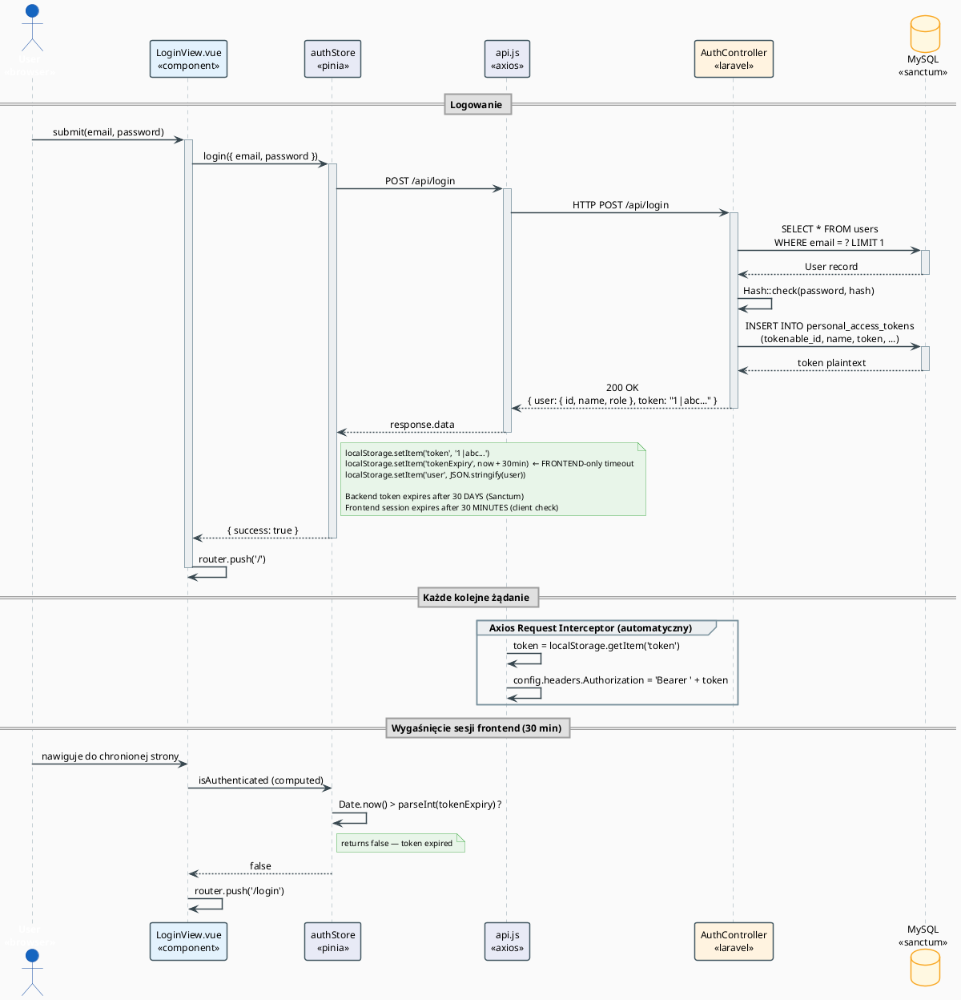

# Autentykacja — Laravel Sanctum + Vue

## Jak to działa (krótko)

1. Użytkownik wpisuje email + hasło
2. Laravel weryfikuje credentiale i zwraca **token**
3. Frontend zapisuje token w `localStorage` pod kluczem `"token"`
4. **Każdy kolejny request** → Axios interceptor dokłada `Authorization: Bearer <token>`
5. Laravel middleware `auth:sanctum` weryfikuje token przy każdym żądaniu

## Diagram sekwencji logowania



## Ważna różnica: backend vs frontend expiry

| | Backend (Sanctum) | Frontend (authStore) |
|-|-|-|
| Token żyje przez | **30 dni** | **30 minut** |
| Ustawiane przez | `createToken(..., now()->addDays(30))` | `Date.now() + 30*60*1000` |
| Skutek | Token można użyć przez 30 dni | Przeglądarka wylogowuje po 30 min |

Użytkownik jest wylogowywany przez frontend po 30 minutach, ale jego token Sanctum jest nadal ważny na backendzie przez 30 dni (aż do restartu sesji lub manulanego wylogowania).

## Axios interceptor (api.js)

```javascript
// frontend/src/services/api.js
api.interceptors.request.use((config) => {
  const token = localStorage.getItem('token')  // ← klucz "token"
  if (token) {
    config.headers.Authorization = `Bearer ${token}`
  }
  return config
})
```

## Guard routera (router/index.js)

```javascript
router.beforeEach((to, from, next) => {
  const authStore = useAuthStore()

  if (to.meta.requiresAuth && !authStore.isAuthenticated) {
    next('/login')                           // brak tokenu → login
  } else if (to.path === '/login' && authStore.isAuthenticated) {
    next('/')                                // już zalogowany → home
  } else if (to.meta.requiresRole) {
    const userRole = authStore.user?.role
    if (!requiredRoles.includes(userRole)) {
      next('/')                              // zła rola → home
    }
  } else {
    next()
  }
})
```

## Wygaśnięcie tokenu (30 minut)

```javascript
// authStore.js — computed property
const isAuthenticated = computed(() => {
  if (!token.value || !tokenExpiry.value) return false
  const now = Date.now()
  const expiry = parseInt(tokenExpiry.value)
  return now < expiry   // false jeśli minęło 30 min
})
```

Gdy `isAuthenticated` zwraca `false`:  
→ Router guard przekierowuje na `/login`  
→ `authStore.logout()` czyści localStorage

## Wylogowanie

```
POST /api/logout (z Bearer tokenem)
→ Laravel usuwa token z personal_access_tokens
→ Frontend czyści localStorage
→ router.push('/login')
```

## Backend — Handler.php (ważna naprawa!)

```php
// Handler.php — JSON zamiast redirect dla API
protected function unauthenticated($request, AuthenticationException $exception)
{
    return response()->json([
        'message' => 'Unauthenticated. Please log in.',
        'error' => 'unauthenticated'
    ], 401);
}
```

> ⚠️ **Naprawiony bug PHP 8**: Oryginał miał `(Request $request, ...)` — PHP 8 zgłosiło fatal error
> bo typ `Request` jest niezgodny z sygnaturą klasy nadrzędnej (w PHP 7 było tylko warning).
> Fix: usunięcie type hinta `Request`.
