# Role i Dostępy (RBAC)

## Trzy role w systemie

| Rola | Opis | Email testowy | Hasło |
|------|------|---------------|-------|
| `admin` | Pełen dostęp, zarządza katalogiem i produkcją | admin@windowwidow.pl | admin123 |
| `production` | Panel produkcji — zlecenia, partie, problemy | produkcja@windowwidow.pl | prod123 |
| `warehouse` | Panel magazynu — dostawy, materiały | magazyn@windowwidow.pl | mag123 |

## Diagram dostępów

```plantuml
@startuml RBAC_Access_Control
!pragma layout smetana

skinparam backgroundColor #FAFAFA
skinparam defaultFontName Arial
skinparam defaultFontSize 11

skinparam actor {
  BorderThickness 2
  FontStyle bold
  FontSize 12
}

skinparam usecase {
  RoundCorner 12
  BorderThickness 1.5
  FontSize 10
}

skinparam rectangle {
  RoundCorner 10
  BorderThickness 2
  FontStyle bold
  FontSize 12
}

' ACTORS
actor "admin\n<<full access>>" as AD #1565C0
actor "production\n<<manufacturing>>" as PR #2E7D32
actor "warehouse\n<<stock>>" as WH #E65100

' CATALOG MANAGEMENT
rectangle "Product Catalog\n<<admin only>>" #EDE7F6 {
  usecase "Manage Windows\nCRUD + stock update" as UC_WIN
  usecase "Manage Profiles\nCRUD" as UC_PRO
  usecase "Manage Glasses\nCRUD" as UC_GLA
  usecase "Upload Images\nPOST /upload/image" as UC_IMG
}

' ORDERS
rectangle "Customer Orders\n<<admin write / all read>>" #E3F2FD {
  usecase "View Orders\nGET /orders" as UC_ORD_R
  usecase "Manage Orders\nCRUD + status update" as UC_ORD_W
}

' MATERIALS
rectangle "Warehouse Materials\n<<admin + warehouse>>" #FFF8E1 {
  usecase "View Materials\nGET /materials" as UC_MAT_R
  usecase "CRUD Materials\nPOST | PUT | DELETE" as UC_MAT_W
  usecase "Stock In / Out\nadd-stock | remove-stock" as UC_STK
  usecase "Stock History\nGET /materials/:id/movements" as UC_MOV
}

' PRODUCTION
rectangle "Production Panel\n<<admin + production>>" #FFEBEE {
  usecase "View Orders\nGET /production/orders" as UC_PO_R
  usecase "Create Orders\nPOST /production/orders" as UC_PO_C
  usecase "Lifecycle Actions\nconfirm | start | progress" as UC_PO_A
  usecase "Batches & Issues\ncreate-batch | report-issue" as UC_PO_B
  usecase "Ship to Warehouse\nship-to-warehouse" as UC_SHIP
}

' DELIVERIES
rectangle "Warehouse Deliveries\n<<admin + warehouse>>" #E8F5E9 {
  usecase "View Deliveries\nGET /warehouse/deliveries" as UC_DEL_R
  usecase "Delivery Actions\nship | receive | reject" as UC_DEL_A
}

' SHARED
rectangle "Shared — all roles" #F5F5F5 {
  usecase "Dashboard\nGET /dashboard" as UC_DASH
  usecase "Notifications\nGET/POST /notifications" as UC_NOTIF
}

' ── admin ──
AD --> UC_WIN
AD --> UC_PRO
AD --> UC_GLA
AD --> UC_IMG
AD --> UC_ORD_R
AD --> UC_ORD_W
AD --> UC_MAT_R
AD --> UC_MAT_W
AD --> UC_STK
AD --> UC_MOV
AD --> UC_PO_R
AD --> UC_PO_C
AD --> UC_PO_A
AD --> UC_PO_B
AD --> UC_SHIP
AD --> UC_DEL_R
AD --> UC_DEL_A
AD --> UC_DASH
AD --> UC_NOTIF

' ── production ──
PR --> UC_ORD_R
PR --> UC_PO_R
PR --> UC_PO_C
PR --> UC_PO_A
PR --> UC_PO_B
PR --> UC_SHIP
PR --> UC_DASH
PR --> UC_NOTIF

note "Backend (api.php) allows\nrole:production,admin\nfor POST /production/orders.\nFrontend router restricts\n/production/orders/new\nto admin only (inconsistency)" as N_DISCREPANCY

' ── warehouse ──
WH --> UC_MAT_R
WH --> UC_MAT_W
WH --> UC_STK
WH --> UC_MOV
WH --> UC_DEL_R
WH --> UC_DEL_A
WH --> UC_DASH
WH --> UC_NOTIF
@enduml
```



## Jak role są egzekwowane — Backend

### krok 1: Middleware `auth:sanctum`
Wszystkie chronione trasy są owinięte:
```php
Route::middleware(['auth:sanctum'])->group(function () {
    // tylko zalogowani
});
```

### krok 2: Middleware `role:xxx`
```php
// backend/app/Http/Middleware/CheckRole.php
Route::middleware('role:admin')->group(...);
Route::middleware('role:admin,warehouse')->group(...);
Route::middleware('role:production,admin')->group(...);
```

Middleware sprawdza: `$request->user()->role === 'admin'`

### krok 3: Policies (dla niektórych modeli)
- `MaterialPolicy.php` — kto może dodawać/usuwać materiały
- `ProductionOrderPolicy.php` — kto może zarządzać zleceniami

## Jak role są egzekwowane — Frontend

### Router meta + Guard
```javascript
// router/index.js
{
  path: '/admin',
  meta: { requiresAuth: true, requiresRole: ['admin'] }
}
{
  path: '/production',
  meta: { requiresAuth: true, requiresRole: ['production', 'admin'] }
}
{
  path: '/warehouse',
  meta: { requiresAuth: true, requiresRole: ['warehouse', 'admin'] }
}

// Guard:
const userRole = authStore.user?.role
if (!requiredRoles.includes(userRole)) {
  next('/')  // brak uprawnień → home, nie 403
}
```

## Tabela uprawnień szczegółowych

| Akcja | admin | production | warehouse |
|-------|:-----:|:----------:|:---------:|
| Przeglądaj katalog okien | ✅ | ✅ | ✅ |
| Dodaj/edytuj/usuń okno | ✅ | ❌ | ❌ |
| Przeglądaj zamówienia klientów | ✅ | ✅ | ✅ |
| Utwórz/edytuj zamówienie klienta | ✅ | ❌ | ❌ |
| Przeglądaj materiały | ✅ | ❌ | ✅ |
| Dodaj/usuń materiał | ✅ | ❌ | ✅ |
| Dodaj/pobierz stock materiału | ✅ | ❌ | ✅ |
| Utwórz zlecenie produkcyjne | ✅ | ✅* | ❌ |
| Potwierdź zlecenie | ✅ | ✅ | ❌ |
| Wystartuj produkcję | ✅ | ✅ | ❌ |
| Utwórz partię / zgłoś problem | ✅ | ✅ | ❌ |
| Wyślij do magazynu | ✅ | ✅ | ❌ |
| Odbierz dostawę | ✅ | ❌ | ✅ |
| Panel Admin (/admin/*) | ✅ | ❌ | ❌ |
| Dashboard | ✅ | ✅ | ✅ |
> **\*** Backend (`api.php`: `role:production,admin`) zezwala produkcji na `POST /production/orders`. Frontend router (`requiresRole: ['admin']`) blokuje `/production/orders/new` — niespójność do zadresowania.