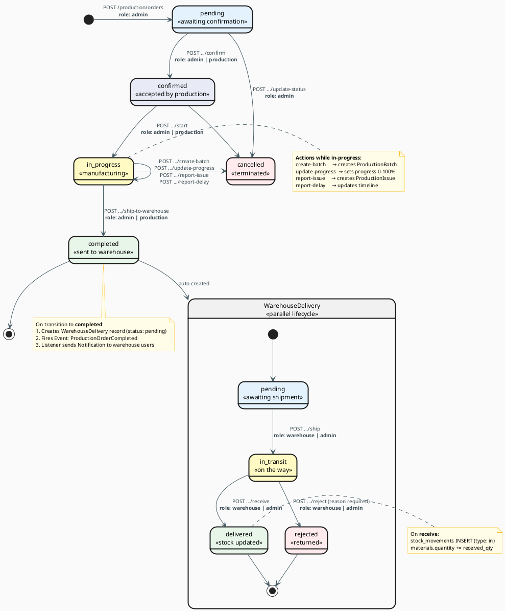

# State Machine — Cykl Życia Zlecenia Produkcyjnego

## Diagram (State Machine)



## Opis każdego stanu

### `pending` — Oczekujące
- Zlecenie właśnie stworzone przez admina
- Dane: order_number, deadline, lista produktów do wykonania
- Czeka na potwierdzenie przez produkcję

### `confirmed` — Potwierdzone  
- Wydział produkcji przyjął zlecenie
- Materiały zarezerwowane
- Czeka na fizyczne uruchomienie linii

### `in_progress` — W trakcie produkcji
- Aktywna praca na hali
- Możliwe tworzenie partii (`ProductionBatch`)
- Możliwe zgłaszanie problemów (`ProductionIssue`)
- Pole `progress_percentage` aktualizowane przez `update-progress`

### `completed` — Ukończone
- Produkcja skończyła
- **Automatycznie** tworzony jest rekord `WarehouseDelivery` (status: pending)
- Wysyłany jest Event `ProductionOrderCompleted` → powiadomienie dla magazynu

### `cancelled` — Anulowane
- Może nastąpić z każdego stanu
- Tylko admin

---

## Cykl WarehouseDelivery

| Status | Kto zmienia | API endpoint |
|--------|-------------|-------------|
| `pending` | Automatycznie (system) | — |
| `in_transit` | Magazyn | `POST /warehouse/deliveries/:id/ship` |
| `delivered` | Magazyn | `POST /warehouse/deliveries/:id/receive` |
| `rejected` | Magazyn | `POST /warehouse/deliveries/:id/reject` |

## Events (Laravel Event System)

```
ProductionStarted         → NotifyWarehouseAboutDelivery listener
ProductionOrderCompleted  → NotifyProductionOrderCompleted listener
LowStockAlert             → NotifyLowStock listener
```

Eventy tworzą rekordy w tabeli `notifications` dla odpowiednich użytkowników.

## Przepływ ról w procesie produkcyjnym

```
admin        → tworzy zlecenie (POST /production/orders)
               ↓
production   → potwierdza (confirm) i startuje (start)  
               ↓
production   → pracuje: create-batch, update-progress, report-issue
               ↓  
production   → wysyła do magazynu (ship-to-warehouse)
               ↓
warehouse    → odbiera dostawę (receive)
               ↓
             GOTOWE ✓
```

## ProductionBatch — Dlaczego?

Duże zamówienia (np. 500 okien) są dzielone na mniejsze partie produkcyjne.  
Każda partia ma własny status i można ją śledzić osobno.

```
ProductionOrder (500 szt)
├── ProductionBatch #1 (167 szt) — completed
├── ProductionBatch #2 (167 szt) — in_progress  
└── ProductionBatch #3 (166 szt) — pending
```
