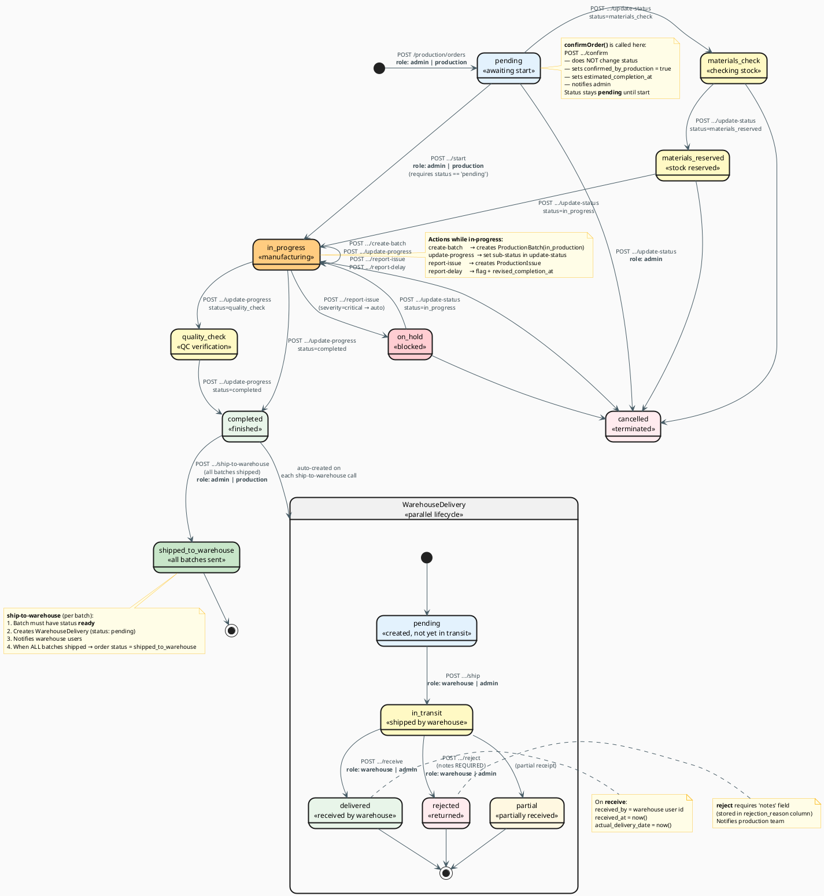

# State Machine — Cykl Życia Zlecenia Produkcyjnego

## Diagram (State Machine)



## Opis każdego stanu

### `pending` — Oczekujące
- Zlecenie właśnie stworzone przez admina lub produkcję
- Można wywołać `confirm` → ustawia flagę `confirmed_by_production=true` **bez zmiany statusu**
- Czeka na `start` (wymaga statusu `pending`)

### `confirmed` — Potwierdzone (FLAGA, nie status DB!)
- `confirmOrder()` ustawia `confirmed_by_production = true` + `estimated_completion_at`
- Status zlecenia **pozostaje `pending`** — `startProduction` wymaga status `pending`
- To celowy design: potwierdzenie jest odnotowane, ale status nie blokuje startu

### `in_progress` / `materials_check` / `materials_reserved` / `quality_check` — W trakcie
- `in_progress` = aktywna praca na hali (ustawiane przez `startProduction` lub `update-status`)
- `materials_check`, `materials_reserved` = opcjonalne etapy pośrednir przez `update-status`
- `quality_check` = kontrola jakości przed `completed`
- Możliwe tworzenie parti (`ProductionBatch`), zgłaszanie problemów (`ProductionIssue`)

### `completed` — Ukończone
- Ustawiany przez `update-progress` (status=completed) lub `update-status`
- Produkcja fizycznie skończona
- Wysyłka do magazynu odbywa się osobno przez `ship-to-warehouse` (niezależnie od tego statusu)

### `shipped_to_warehouse` — Wszystkie partie wysłane
- Ustawiany **automatycznie** gdy WSZYSTKIE partie produktu mają status `shipped`
- Wywołanie `ship-to-warehouse` tworzy rekord `WarehouseDelivery` (status: `pending`) per partię

### `on_hold` — Wstrzymane
- Automatycznie ustawiany gdy issue ma `severity=critical`
- Można cofnąć do `in_progress` przez `update-status`
- Można anulować

### `cancelled` — Anulowane
- Może nastąpić z każdego stanu (oprócz `shipped_to_warehouse`)
- Tylko admin

---

## Cykl WarehouseDelivery

| Status | Kto zmienia | API endpoint |
|--------|-------------|-------------|
| `pending` | Automatycznie przy tworzeniu dostawy | — |
| `in_transit` | Magazyn | `POST /warehouse/deliveries/:id/ship` |
| `delivered` | Magazyn | `POST /warehouse/deliveries/:id/receive` |
| `rejected` | Magazyn | `POST /warehouse/deliveries/:id/reject` (pole `notes` wymagane) |
| `partial` | Magazyn | (częściowe odebranie) |

## Events (Laravel Event System)

```
ProductionStarted         → NotifyWarehouseAboutDelivery listener
ProductionOrderCompleted  → NotifyProductionOrderCompleted listener
LowStockAlert             → NotifyLowStock listener
```

Eventy tworzą rekordy w tabeli `notifications` dla odpowiednich użytkowników.

## Przepływ ról w procesie produkcyjnym

```
admin        → tworzy zlecenie (POST /production/orders)  ← role: admin | production
               ↓
admin/prod   → (opcjonalnie) potwierdza flagę (POST .../confirm) — status nadal pending
               ↓
production   → startuje (POST .../start)  ← wymaga status == 'pending'
               ↓
production   → pracuje: update-progress (materials_check, materials_reserved,
                          in_progress, quality_check, completed)
               ↓  
production   → tworzy parti (create-batch) i oznacza jako ready
               ↓
production   → wysyła parti do magazynu (ship-to-warehouse) ← tworzy WarehouseDelivery
               ↓
warehouse    → odbiera dostawę (POST /warehouse/deliveries/:id/receive)
               ↓
             GOTOWE ✓
```

## ProductionBatch — Dlaczego?

Duże zamówienia (np. 500 okien) są dzielone na mniejsze partie produkcyjne.  
Każda partia ma własny status i można ją śledzić osobno.

```
ProductionOrder (500 szt)
├── ProductionBatch #1 (167 szt) — completed
├── ProductionBatch #2 (167 szt) — in_progress  
└── ProductionBatch #3 (166 szt) — pending
```
