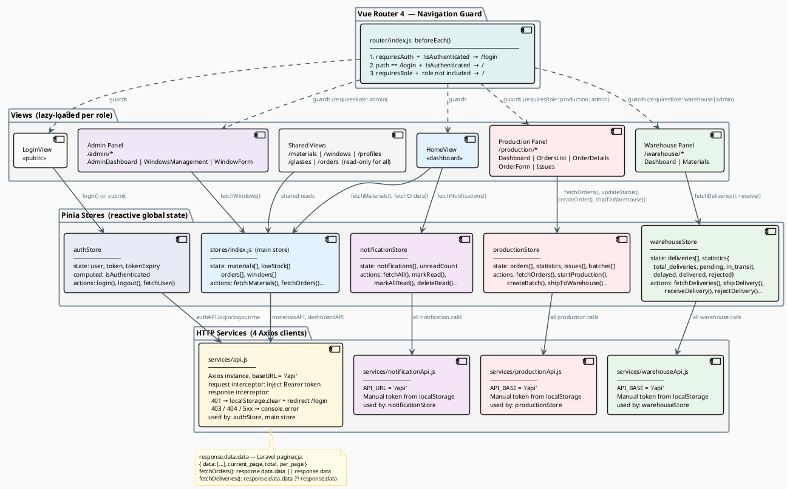

# Frontend — Przepływ Danych Vue 3 + Pinia

## Diagram



## Pinia — authStore (kluczowy store)

```javascript
// stores/auth.js
const user = ref(null)
const token = ref(localStorage.getItem('token'))
const tokenExpiry = ref(localStorage.getItem('tokenExpiry'))

const isAuthenticated = computed(() => {
  if (!token.value || !tokenExpiry.value) return false
  return Date.now() < parseInt(tokenExpiry.value)  // 30 minut
})
```

**Kluczowe rzeczy**:
- Token sesji trwa **30 minut** (odnowienie wymaga ponownego logowania)
- `isAuthenticated` to `computed` — reaktywnie aktualizuje się
- Router guard używa `isAuthenticated` przy każdej nawigacji

---

## Pinia — warehouseStore (zaktualizowany)

```javascript
// stores/warehouseStore.js
statistics: {
  total_deliveries: 0,
  pending: 0,
  in_transit: 0,
  delayed: 0,
  delivered_today: 0,
  delivered: 0,   // ← dodane
  rejected: 0     // ← dodane
}
```

`fetchStatistics()` odpyta `GET /api/warehouse/deliveries/statistics` — backend
now returns all 7 fields (was missing `total_deliveries`, `delivered`, `rejected`).

---

## 4 klienty Axios (nie jeden!)

| Plik | Kto używa | Interceptor | Token |
|------|------------|-------------|-------|
| `services/api.js` | authStore, main store | request + response | interceptor |
| `services/productionApi.js` | productionStore | brak | ręcznie z localStorage |
| `services/warehouseApi.js` | warehouseStore | brak | ręcznie z localStorage |
| `services/notificationApi.js` | notificationStore | brak | ręcznie z localStorage |

Tylko `api.js` ma interceptor odpowiedzi (401 → redirect `/login`, 403 → log).
Pozostałe 3 klienty używają `getAuthHeaders()` / ręcznego `localStorage.getItem('token')`.

---

## Struktura katalogów frontend/src/

```
src/
├── App.vue                   ← root komponent, montuje <router-view>
├── main.js                   ← rejestruje Vue app + Pinia + Router
│
├── router/
│   └── index.js              ← trasy + beforeEach guard
│
├── stores/
│   ├── auth.js               ← logowanie, token, user
│   ├── index.js              ← materials, orders, windows, lowStock
│   ├── productionStore.js    ← zlecenia produkcji, statystyki, issues
│   ├── warehouseStore.js     ← dostawy magazynowe
│   └── notificationStore.js  ← powiadomienia
│
├── services/
│   ├── api.js                ← Axios + interceptor, bazowy klient
│   └── warehouseApi.js       ← Axios dla magazynu (osobny klient)
│
└── views/
    ├── LoginView.vue          ← formularz logowania
    ├── HomeView.vue           ← ogólny dashboard
    ├── MaterialsView.vue      ← podgląd materiałów (wszyscy)
    ├── WindowsView.vue        ← katalog okien
    ├── ProfilesView.vue       ← katalog profili
    ├── GlassesView.vue        ← katalog szyb
    ├── OrdersView.vue         ← zamówienia klientów
    ├── admin/
    │   ├── AdminDashboard.vue
    │   ├── WindowsManagement.vue
    │   └── WindowForm.vue
    ├── production/
    │   ├── ProductionDashboard.vue
    │   ├── ProductionOrdersList.vue
    │   ├── ProductionOrderDetails.vue
    │   ├── ProductionOrderForm.vue
    │   └── ProductionIssues.vue
    └── warehouse/
        ├── WarehouseDashboard.vue
        └── Materials.vue
```

---

## Lazy Loading widoków (Vue Router)

```javascript
// router/index.js — komponenty ładowane dopiero kiedy potrzebne
component: () => import('../views/production/ProductionOrdersList.vue')
```

→ Mniejszy bundle startowy  
→ Każdy panel (admin/produkcja/magazyn) ładuje się przy pierwszej wizycie
