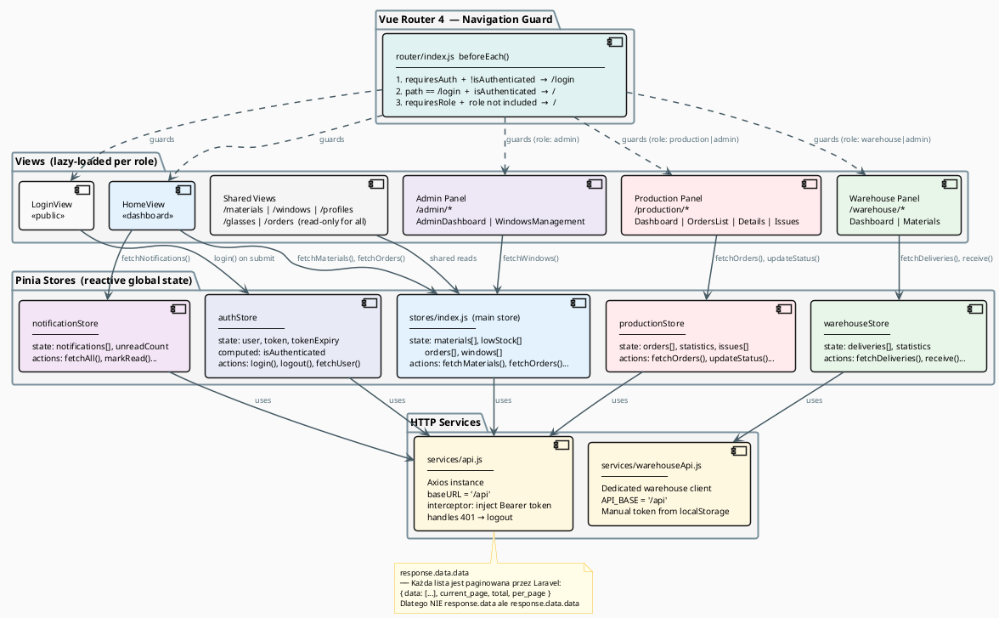

# Frontend — Przepływ Danych Vue 3 + Pinia

## Diagram



## Pinia — authStore (kluczowy store)

```javascript
// stores/auth.js
const user = ref(null)
const token = ref(localStorage.getItem('token'))
const tokenExpiry = ref(localStorage.getItem('tokenExpiry'))

const isAuthenticated = computed(() => {
  if (!token.value || !tokenExpiry.value) return false
  return Date.now() < parseInt(tokenExpiry.value)  // 30 minut
})
```

**Kluczowe rzeczy**:
- Token sesji trwa **30 minut** (odnowienie wymaga ponownego logowania)
- `isAuthenticated` to `computed` — reaktywnie aktualizuje się
- Router guard używa `isAuthenticated` przy każdej nawigacji

---

## Pinia — stores/index.js (główny store danych)

```javascript
// stores/index.js
async function fetchMaterials() {
  const response = await api.get('/materials')
  materials.value = response.data.data ?? response.data  // ← unwrap paginacji!
}
```

> ⚠️ **Ważne**: Laravel zwraca paginację `{ data: [...], current_page: 1, total: 50 }`.  
> Dlatego `response.data.data` — pierwsze `.data` to Axios, drugie `.data` to Laravel pagination.

---

## Jak działa żądanie HTTP (krok po kroku)

```
1. Komponent wywołuje store.fetchMaterials()
2. Store wywołuje api.get('/materials')
3. Axios interceptor dodaje nagłówek:
   Authorization: Bearer <token z localStorage>
4. Vite proxy przekierowuje /api/materials → http://localhost:8000/api/materials
5. Laravel sprawdza token (Sanctum middleware)
6. Kontroler odpowiada JSON z paginacją
7. Store zapisuje response.data.data do state
8. Komponent reaktywnie re-renderuje się przez Vue reactivity
```

---

## Struktura katalogów frontend/src/

```
src/
├── App.vue                   ← root komponent, montuje <router-view>
├── main.js                   ← rejestruje Vue app + Pinia + Router
│
├── router/
│   └── index.js              ← trasy + beforeEach guard
│
├── stores/
│   ├── auth.js               ← logowanie, token, user
│   ├── index.js              ← materials, orders, windows, lowStock
│   ├── productionStore.js    ← zlecenia produkcji, statystyki, issues
│   ├── warehouseStore.js     ← dostawy magazynowe
│   └── notificationStore.js  ← powiadomienia
│
├── services/
│   ├── api.js                ← Axios + interceptor, bazowy klient
│   └── warehouseApi.js       ← Axios dla magazynu (osobny klient)
│
└── views/
    ├── LoginView.vue          ← formularz logowania
    ├── HomeView.vue           ← ogólny dashboard
    ├── MaterialsView.vue      ← podgląd materiałów (wszyscy)
    ├── WindowsView.vue        ← katalog okien
    ├── ProfilesView.vue       ← katalog profili
    ├── GlassesView.vue        ← katalog szyb
    ├── OrdersView.vue         ← zamówienia klientów
    ├── admin/
    │   ├── AdminDashboard.vue
    │   ├── WindowsManagement.vue
    │   └── WindowForm.vue
    ├── production/
    │   ├── ProductionDashboard.vue
    │   ├── ProductionOrdersList.vue
    │   ├── ProductionOrderDetails.vue
    │   ├── ProductionOrderForm.vue
    │   └── ProductionIssues.vue
    └── warehouse/
        ├── WarehouseDashboard.vue
        └── Materials.vue
```

---

## Lazy Loading widoków (Vue Router)

```javascript
// router/index.js — komponenty ładowane dopiero kiedy potrzebne
component: () => import('../views/production/ProductionOrdersList.vue')
```

→ Mniejszy bundle startowy  
→ Każdy panel (admin/produkcja/magazyn) ładuje się przy pierwszej wizycie
